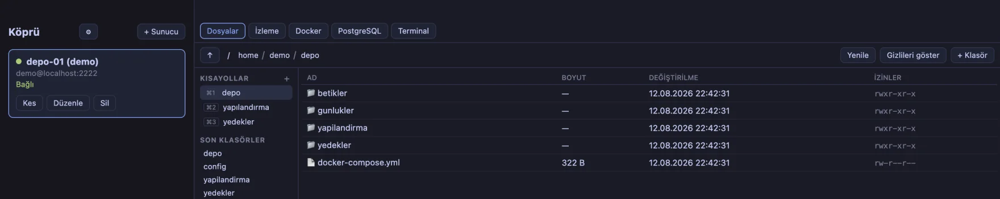
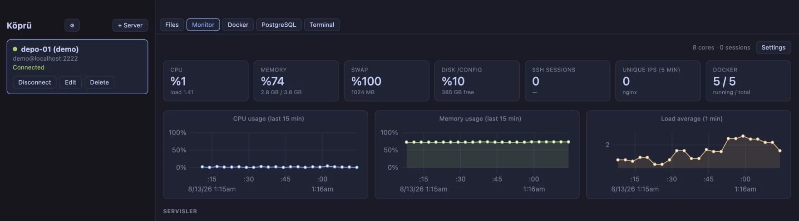
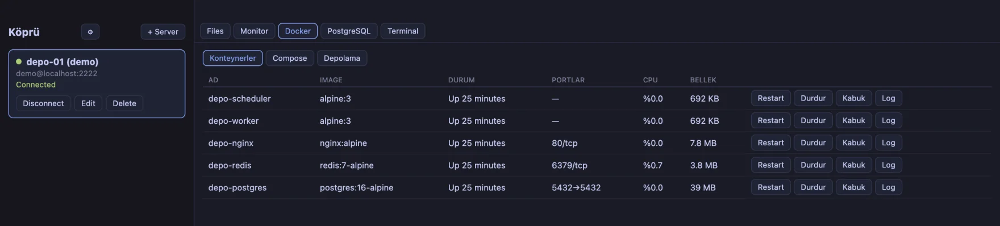
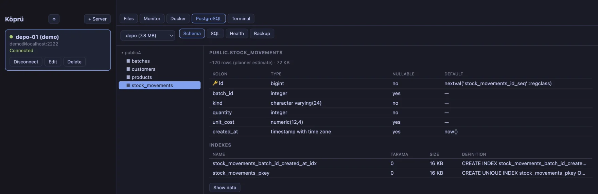
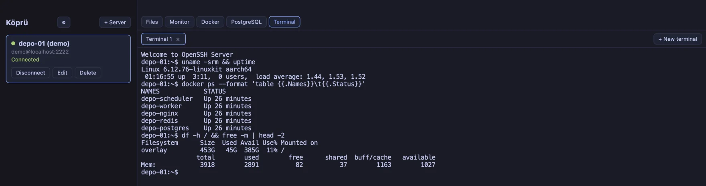
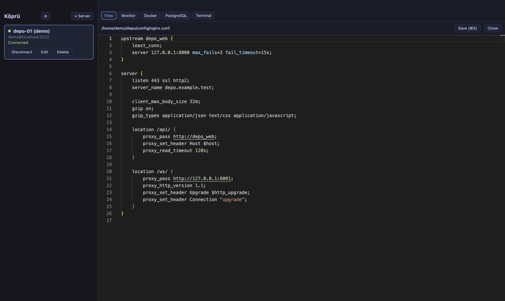
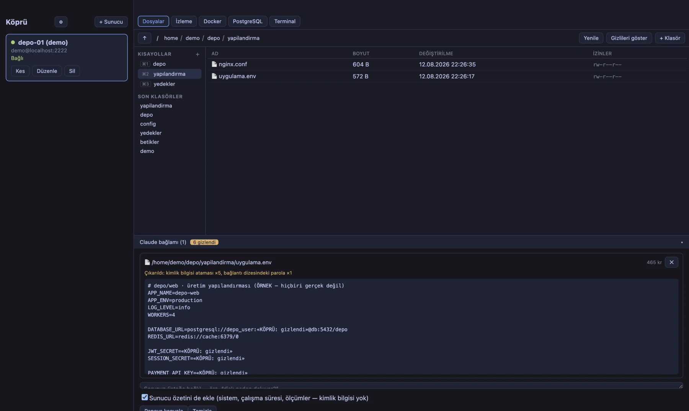

<div align="center">

# Köprü

**A desktop SSH control centre for people who run their own servers.**

Terminal, file browser, live metrics, Docker and PostgreSQL — all multiplexed over
a *single* SSH connection, with no agent to install on the server.

[](LICENSE)
[](https://electronjs.org)
[](https://typescriptlang.org)

[Download](#download) · [Screenshots](#screenshots) · [Why](#why-it-exists) · [Architecture](#architecture) · [Build from source](#build-from-source)

Part of my portfolio → [**ismailcemsahin.com**](https://ismailcemsahin.com/#/proje/kopru)

</div>

---

## Why it exists

Managing a small fleet of Linux servers means keeping four windows open: a terminal, an
SFTP client, `docker ps` on a loop, and a database GUI. Each of those opens its **own**
SSH connection. Four handshakes, four things to reconnect, four places the credentials
live.

Köprü collapses them into one window and, more importantly, **one SSH connection**.
Terminal shells, SFTP channels, metric polling and the database tunnel are all
channels multiplexed over that single connection — which is what the SSH protocol was
designed for in the first place.

**Nothing is installed on the server.** Every capability is built from commands that
already exist on a stock Linux box: `/proc/stat`, `df`, `systemctl`, `docker`, and the
SFTP subsystem. If you can SSH in, Köprü works.

## Features

| | |
|---|---|
| **Terminal** | Multiple xterm.js tabs per host, WebGL renderer, search. Tabs survive a dropped connection — scrollback is preserved and a fresh pty is attached on reconnect. |
| **Files** | Two-lane SFTP (browsing and transfers never block each other), remote Monaco editor with syntax highlighting, `sudo` saves, chmod, archive create/extract, per-profile bookmarks. |
| **Monitor** | CPU / memory / disk / load / network sampled on one command chain, charted with µPlot. systemd unit status, nginx log rates, native desktop alerts with hysteresis so a disk parked at 91% does not notify you every five seconds. |
| **Docker** | Container list, start/stop/restart, live `docker logs -f` follow, `docker stats`, disk usage, compose file editing and apply, guarded prune with a preview of exactly what will be deleted. |
| **PostgreSQL** | Connects **through** the SSH channel with no local port bound anywhere on your machine. Schema tree, data grid, `EXPLAIN`, health panel, `pg_dump` backup. Read-only by default — enforced by a real `READ ONLY` transaction, not a regex. |
| **Context bridge** | Assembles a system summary (metrics, service states, recent errors) and **redacts secrets out of it** before you paste it into an AI assistant. Every redaction is counted and labelled, never silent. |

Ships with light/dark/system themes and multi-window support.

## Screenshots

> The server in these captures is a throwaway Linux target brought up purely for
> the screenshots — every file, container and database row on it is fictional.
> The interface language is Turkish (see [Status](#status)).

**Files** — remote listing with per-profile shortcuts and recent folders. Browsing
and transfers run on separate SFTP channels, so a large download never blocks the
listing.



**Monitor** — CPU, memory, disk, load and network from a single command chain,
charted with µPlot. Memory is measured against `MemAvailable`; `used` counts
reclaimable cache and makes a healthy server read as full.



**Docker** — containers with status, ports and live resource usage. The cheap
census rides along every tick; the expensive `docker stats` runs only while this
panel is mounted.



**PostgreSQL** — schema tree, table detail, indexes with their scan counts. The
connection runs *inside* the SSH channel; no local port is bound on your machine.



**Terminal** — one shell channel per tab, all over the same SSH connection. A
dropped connection does not close the tab: the scrollback stays and a fresh shell
attaches on reconnect.



**Remote editor** — files fetched over SFTP and opened in Monaco. Privileged saves
go through `sudo` via a temporary copy, with the password written to the command's
standard input rather than its argument list.



**Context bridge** — a configuration file collected for an AI assistant, with its
secrets redacted first. The badge counts what was hidden; the line under it says
what kind. Here: five credential assignments and one password inside a connection
string.



## Download

Grab the latest build from the [**Releases**](https://github.com/cem19011901/kopru/releases/latest) page.

| Platform | File |
|---|---|
| macOS · Apple Silicon | `Kopru-<version>-arm64.dmg` |
| macOS · Intel | `Kopru-<version>.dmg` |
| Windows · x64 | `Kopru-Setup-<version>.exe` |

> **macOS Gatekeeper:** builds are **ad-hoc signed**, not notarised (notarisation
> requires a paid Apple Developer account). On first launch macOS will refuse to open
> the app. Right-click the app → **Open** → **Open**, or run
> `xattr -dr com.apple.quarantine /Applications/Kopru.app` once.
>
> **Windows SmartScreen:** the installer is unsigned. Click *More info* →
> *Run anyway*.
>
> If you would rather not trust an unsigned binary, [build it from source](#build-from-source) —
> it takes about a minute.

## Security model

This is an app that holds SSH credentials, so the choices are worth stating plainly:

- **Host keys are pinned on first use.** The SHA256 fingerprint is shown in a native
  dialog raised from the main process (not the renderer, which removes a class of
  spoofed-prompt attacks). On a later mismatch the connection is **refused** — there is
  deliberately no "continue anyway" button. A changed host key is either a server
  rebuild or an active MITM, and the dialog cannot tell you which.
- **Secrets are encrypted at rest** with Electron `safeStorage`, which is Keychain-backed
  on macOS and DPAPI-backed on Windows. They are decrypted only at connect time and never
  leave the main process.
- **The database tunnel binds no local port.** `node-postgres` accepts a stream factory,
  so it is handed the ssh2 `direct-tcpip` channel directly. There is no TCP listener on
  your machine for another local process — or another user account — to connect to.
- **Database write mode resets to off on every panel open** and is never persisted.
- **Context leaving the app is redacted** — private keys, credential assignments,
  connection-string passwords, bearer tokens. The redactor is deliberately over-eager:
  a wrongly hidden line costs one manual paste, a leaked key costs the server.
- **No telemetry, no network calls** other than the SSH connection you configure.

## Architecture

```
┌─ main process ──────────────────────────────┐
│  ssh/manager  ── one ssh2.Client per host   │
│      │                                      │
│      ├── shell channels  → terminal tabs    │
│      ├── sftp × 2        → browse | transfer│
│      ├── exec channels   → metrics, docker  │
│      └── direct-tcpip    → postgres stream  │
│                                             │
│  modules/  monitor · docker · files · pg    │
└──────────────┬──────────────────────────────┘
               │  typed IPC contract (shared/ipc.ts)
               │  invoke · send · event — no `any`
┌──────────────┴──────────────────────────────┐
│  renderer — React 19 + Zustand              │
│  features/ terminal files monitor docker pg │
└─────────────────────────────────────────────┘
```

Three rules hold the design together:

1. **One connection per host.** A second connection per feature costs a full TCP + KEX +
   auth handshake, counts against the server's `MaxSessions`, and multiplies the
   reconnect surface.
2. **One typed IPC contract.** Every channel name and its request/response types live in
   `src/shared/ipc.ts` and nowhere else. `any` is banned in that file — an untyped
   channel is an untyped process boundary.
3. **No native modules.** No `node-pty`, no `cpu-features`. Native addons must be rebuilt
   against Electron's ABI and turn `npm ci` into a compiler-toolchain requirement.
   Terminals are *remote* shell channels, so a local pty was never needed.

### Design decisions

Fourteen decisions — including the ones that went against the original spec — are
recorded in [`docs/ADR/`](docs/ADR/). Each states the trade-off it accepted, not just
the choice it made:

- [0001](docs/ADR/0001-single-connection-multi-channel.md) One connection, many channels
- [0003](docs/ADR/0003-host-key-pinning.md) Host key pinning with no override
- [0004](docs/ADR/0004-reconnect-and-session-lifetime.md) What "session survival" honestly means
- [0007](docs/ADR/0007-sftp-two-lanes.md) Why SFTP needs two channels
- [0010](docs/ADR/0010-alert-hysteresis.md) Alert hysteresis, and why memory is measured against `MemAvailable`
- [0011](docs/ADR/0011-docker-two-poll-rates.md) Two Docker poll rates, for two reasons
- [0012](docs/ADR/0012-pg-tunnel-without-local-port.md) The database tunnel binds nothing
- [0013](docs/ADR/0013-read-only-is-a-transaction.md) Read-only is a transaction, not a regex
- [0014](docs/ADR/0014-packaging.md) Why the bundle is named `Kopru` and not `Köprü`
- [claude-sdk](docs/ADR/claude-sdk.md) Why the AI integration is a context bridge, not an agent

## Build from source

Requires Node.js 20+.

```bash
git clone https://github.com/cem19011901/kopru.git
cd kopru
npm ci

npm run dev        # run in development
npm run typecheck  # tsc, both tsconfigs
npm run lint       # eslint, type-aware rules
npm run dist       # packaged macOS build → release/
```

For a Windows build, run `npx electron-builder --win` on Windows — or push a tag and
let [the release workflow](.github/workflows/release.yml) build both platforms.

## Testing

Manual test guides for each development phase are in [`docs/`](docs/) —
`TEST-FAZ1.md` through `TEST-FAZ6-7.md`. They are written in Turkish and cover the
paths that are hard to assert automatically: reconnect behaviour under a dropped
connection, sudo saves, transfer cancellation, prune guards, read-only enforcement.

## Status

Working and in daily use against production servers, but a personal project —
no support commitments. Issues and pull requests are welcome.

The UI language is **Turkish**. English localisation is not implemented.

## Licence

[MIT](LICENSE) © İsmail Cem Şahin
